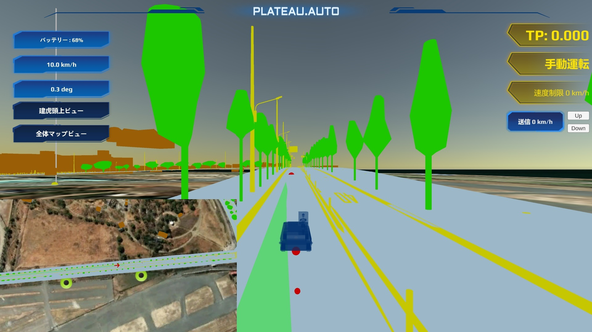

# AGVリアルタイムモニタリングシステム
- AGVリアルタイムモニタリングシステムは3D都市モデルを活用し、車両のリアルタイム情報をモニタリングするための車両監視ビュワーです。
- Unityで開発をしており、シーン、スクリプト、3D都市モデル（obj形式）、車両のモデル（obj形式）を公開しております。
- 車両の情報（ステアリング角度、速度、自動運転モード）の表示、3Dマップビュワーの機能があります。

  

<!-- ドキュメントビルド -->
<!-- docfx Documentation/docfx.json cache clear -->
<!-- docfx Documentation/docfx.json --serve -->