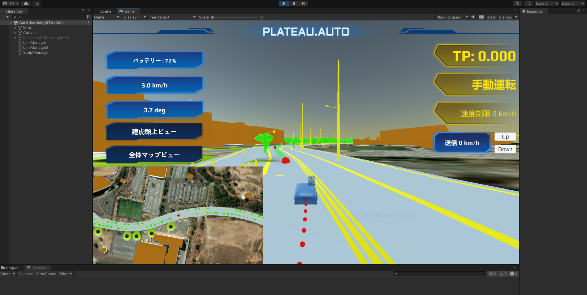

# 起動手順（実際の車両を利用）

## シーン起動手順

1. Windows PCに本リポジトリをクローンします
2. UnityHubにて本プロジェクトを起動します
  

3. Assets/Scenes/CarDriveUsingRTKnGML.unity を開きます
  

4. Unityの再生ボタンを押します
  

## 車両の環境

- ROS Noetic / ROS2 Galactic
    - [mqtt_bridge](https://github.com/groove-x/mqtt_bridge)
        - mqtt_bridgeはROSのトピックをJSONに変換し、MQTTサーバーに送るライブラリです
        - ROS1, ROS2で仕様が異なるので、お使いの

1. ROS / ROS2を使って車両を構築します

2. 下記の情報を、ROSメッセージで送信します
- 本プロジェクトでは車両の制御にAutowareを利用しているため、実際の車両で使う場合は適した型・トピック名に変更をしてください。

|  項目  |  型  | MQTTに送るトピック　|
| ---- | ---- | ---- |
|  バッテリー残量  |  std_msgs.msg:Int8  | /BatteryLevel |
|  車速  | autoware_auto_vehicle_msgs.msg:VelocityReport  | /vehicle/status/velocity_status |
|  ステアリング角度  |  autoware_auto_vehicle_msgs.msg:SteeringReport  | /vehicle/status/steering_status |
|  自動運転モード  |  std_msgs.msg:Int8  | /EcuMode  |
|  車両位置情報  |  sensor_msgs.msg:NavSatFix  | /NavSatFix |